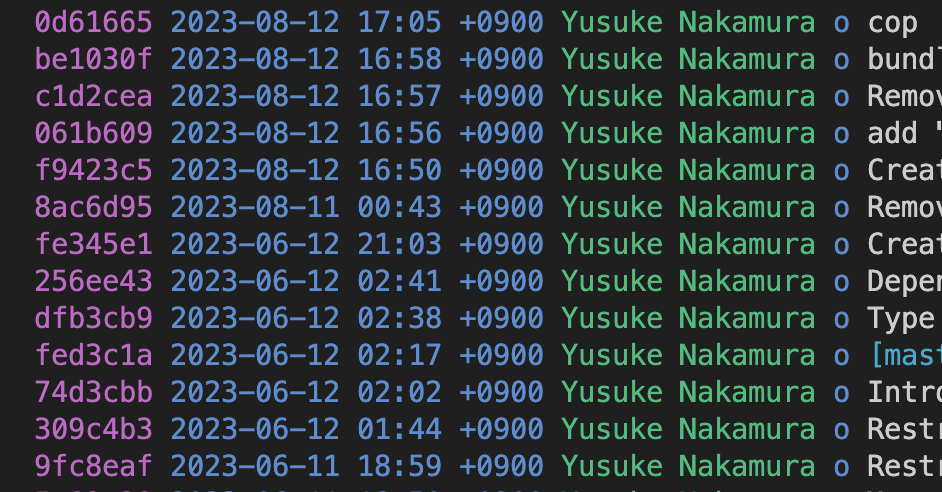

# RubyishなQUIC実装の\\n進捗について

author
:  うなすけ

content-source
:  RubyKaigi 2023 follow up

date
:  2023-08-19

theme
:  theme

# 自己紹介

* Name: うなすけ
* Work: フリーランス
* Kaigi on Rails オーガナイザー (10/27-28 開催)
* {::tag name='x-small'}GitHub <https://github.com/unasuke>{:/tag}
* {::tag name='x-small'}ActivityPub <https://mstdn.unasuke.com/@unasuke>{:/tag}
* {::tag name='x-small'}X (Twitter) <https://twitter.com/yu_suke1994>{:/tag}
* {::tag name='x-small'}<https://unasuke.com>{:/tag}

{:relative_width='24' align='right' relative_margin_right='-8' relative_margin_top='20'}

# RubyKaigi 2023の復習
* QUICとは何か、という話はすっ飛ばします
* PythonのQUIC実装aioquicをRubyに移植した
  * 移植元 → <https://github.com/aiortc/aioquic>
  * 移植先 → <https://github.com/unasuke/raioquic>
    * "Ruby" の "aioquic" で "raioquic"

# commit log
{:relative_width="90"}

# 言い訳タイム
* IETF 117 San Francisco
  * 参加記がまだ書けていない……
* CloudNative Days Fukuoka 2023
  * 発表した
  * <https://event.cloudnativedays.jp/cndf2023/talks/1890>
* Kaigi on Rails 2023
  * 絶賛準備中！
* RFC 8446を読んでた(後述)
* 例のアレ

# コードでやったこと
* HKDF (RFC 5869)
  * <https://www.rfc-editor.org/rfc/rfc5869.html>
* AEAD (RFC 5116, RFC 9001)
  * <https://www.rfc-editor.org/rfc/rfc5116.html>
  * <https://www.rfc-editor.org/rfc/rfc9001.html#name-aead-usage>
* YARDを書いている
* エディタで見せたほうが早い

# コード外でやったこと
* RFC 8446 (TLS 1.3)をイチから読み直した
  * <https://www.rfc-editor.org/rfc/rfc8446.html>
  * <https://datatracker.ietf.org/doc/draft-ietf-tls-rfc8446bis/>

# 悩んでいること
* API
  * "Rubyish" ってなんだ……？
  * 例 `raioquic/lib/raioquic/tls.rb`
